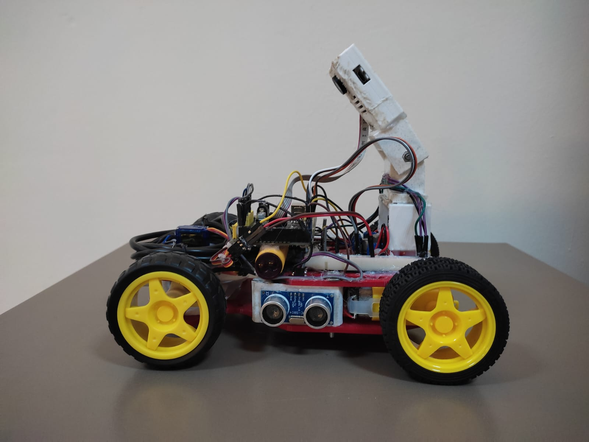
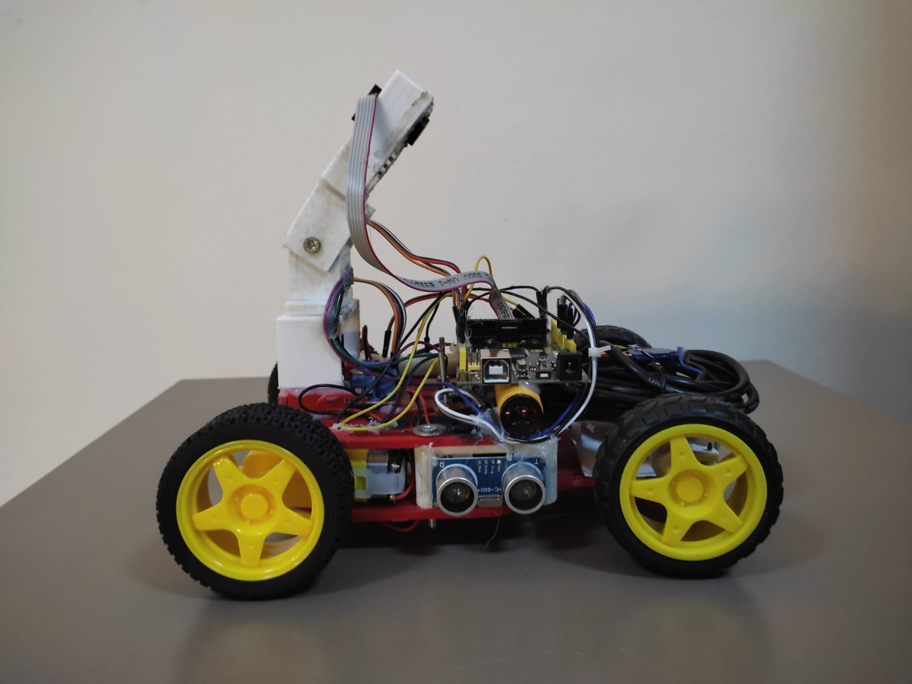
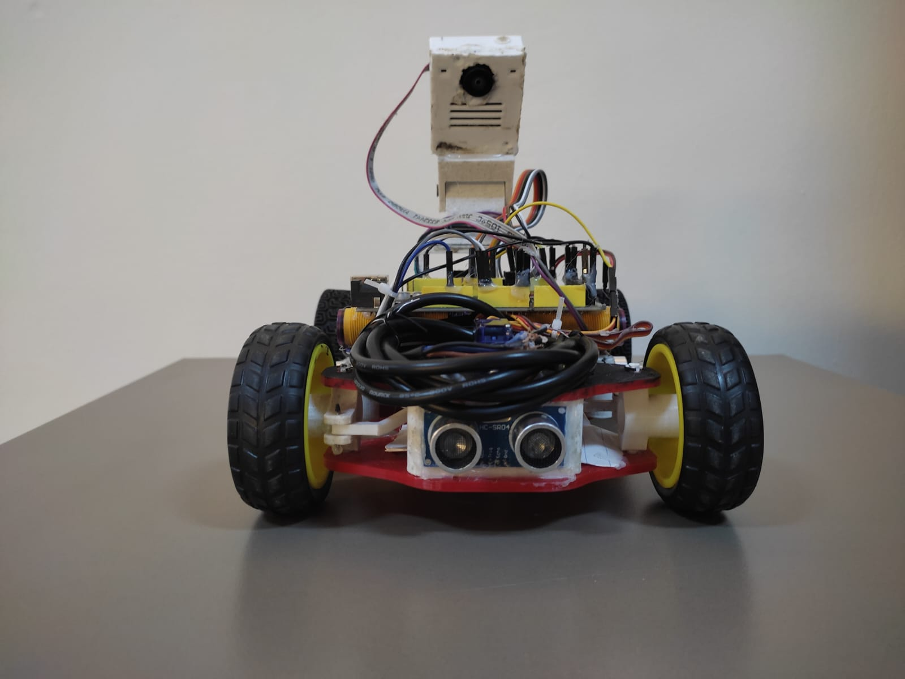
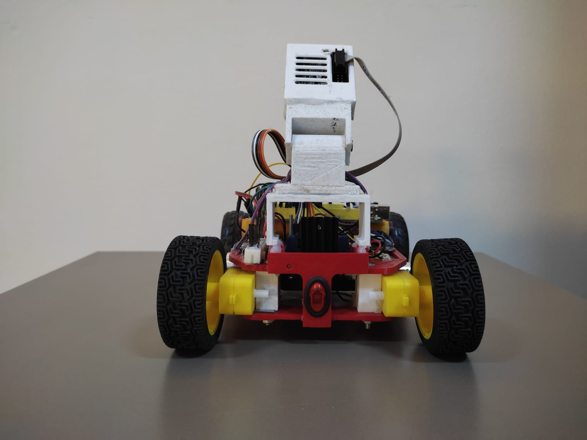
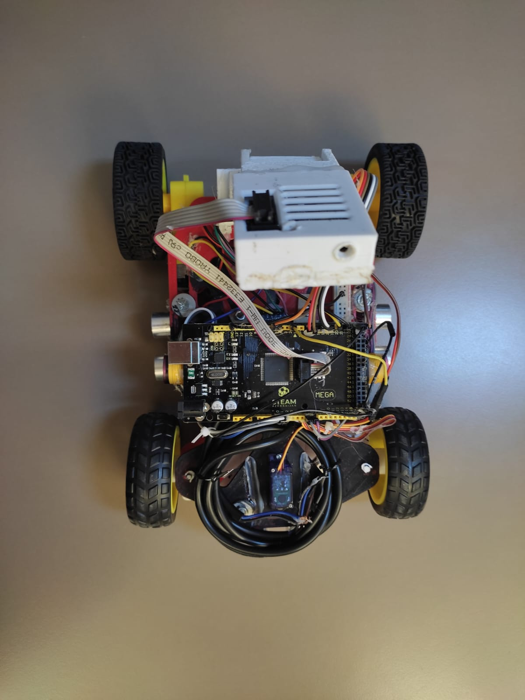
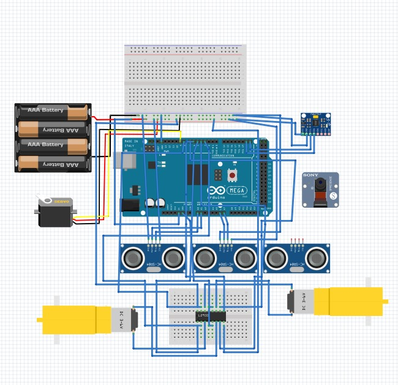
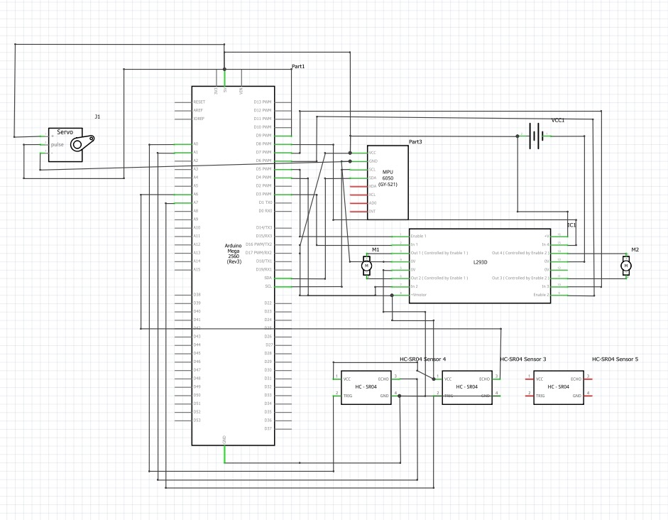
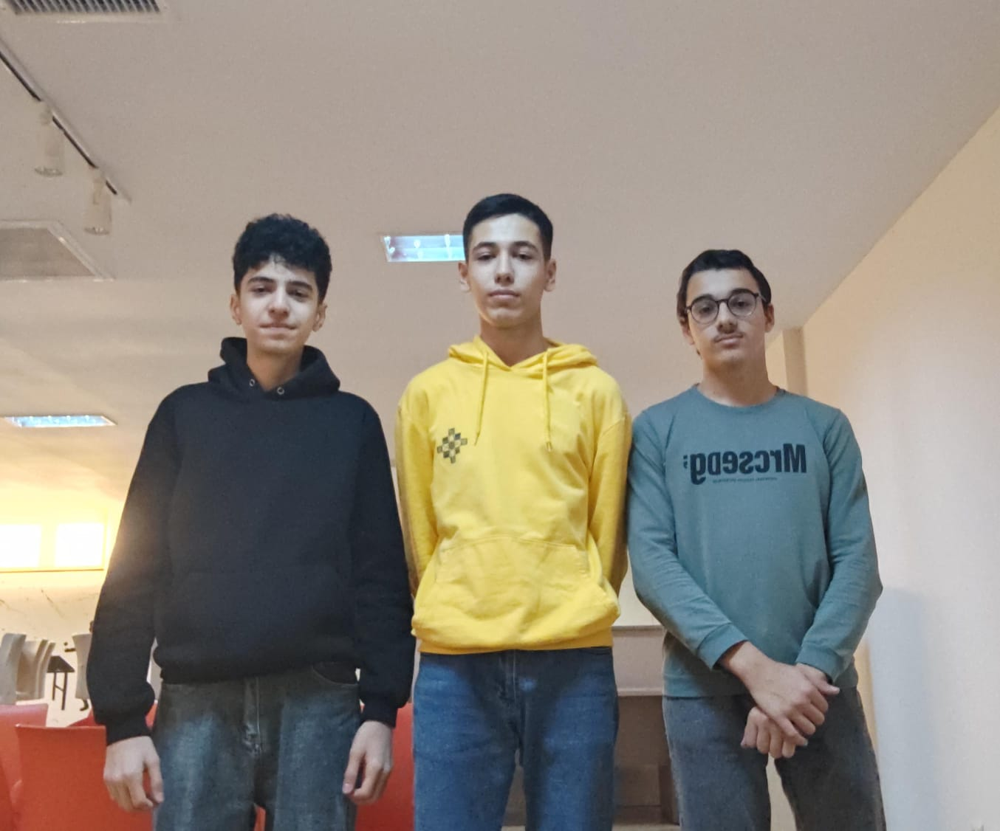

# SHUSHA-AZE 2024
 ## Topics

* [Electronic-Components](#components)
   * [Power Managament](#power)
* [Robot Photos](#robotphotos)
* [Performance video](#pvideo)
* [Scheme](#scheme)
* [TeamPhoto](#tphoto)
* [Steering system](#system)
* [Codes](#code)
  * [First Round](#code)
  * [Second Round](#code2nd)
    

### Electronic-Components <a class="anchor" id="components"></a>
* Pixy2.1 cam  
   


The main reason we chose the Pixy 2.1 is its high performance and real-time processing capabilities. Initially, we considered using the ESP CAM, but after discovering its limited image processing capabilities and noticeable latency, we decided to switch to the Pixy 2.1. Pixy 2.1 is a specialized image processing sensor designed for recognizing colors and tracking objects. It can also integrate with various programming platforms and is easily connectable to Arduino, Raspberry Pi, STM32, and other microcontrollers. Moreover, Pixy 2.1 can simultaneously perform multiple object recognition and tracking functions, making it highly convenient for our needs. Another advantage of this camera is its user-friendly interface. It supports numerous communication protocols, such as USB, UART, I2C, and SPI, allowing seamless integration with any microcontroller and other electronic components. Therefore, choosing Pixy 2.1 has enabled our robot to achieve more precise and faster image processing.

### Wth this code measure distance

```ino
#include <Pixy2.h>
#include <Servo.h>

Servo servo_9;
long duration;
int distance;
 float knownWidth = 5.0;
 float focalLength = 218; 
 int colorX = 0;
Pixy2 pixy;

void setup() {
  servo_9.attach(2);
  Serial.begin(9600);
  pixy.init();
}

void loop() {
  pixy.ccc.getBlocks();
  
  if (pixy.ccc.numBlocks) {
    int objectWidth = pixy.ccc.blocks[0].m_width; 
    int colorX = pixy.ccc.blocks[0].m_x;
    
    float distance = (knownWidth * focalLength) / objectWidth;
    Serial.println(distance);
    delay(50);
  }
}
```

### Passing cubes with pixy

```ino
        pixy.ccc.getBlocks();
    bool greenDetected = false, redDetected = false;  
    int colorX = 0, k = 0, j = 0, old = 0, mx = 0;
    height = 0;
    for (int i = 0; i < pixy.ccc.numBlocks; i++) {
      if(old <= (pixy.ccc.blocks[i].m_x) * (pixy.ccc.blocks[i].m_height)){
        old = (pixy.ccc.blocks[i].m_x) * (pixy.ccc.blocks[i].m_height);
        j = i;
      }
    }
      if (pixy.ccc.blocks[j].m_signature == 1) {
        greenDetected = true;
        colorX = pixy.ccc.blocks[j].m_x;
        objectWidth = pixy.ccc.blocks[j].m_width;
        height = pixy.ccc.blocks[j].m_height;
      }
      if (pixy.ccc.blocks[j].m_signature == 2) {
        redDetected = true;
        colorX = pixy.ccc.blocks[j].m_x;
        objectWidth = pixy.ccc.blocks[j].m_width;
        height = pixy.ccc.blocks[j].m_height;
      }
    

    distance = (knownWidth * focalLength) / objectWidth;

  if (redDetected) {
    if ((R == 1 && abs(currentAngle - targetAngle) <= 50) || L == 1) {
        updateGyroAngle();
        last_color = 2;

        if (colorX > 90) {
            servo_9.write(70);
        } else if (R == 1 && colorX < 40 && abs(currentAngle - targetAngle) >= 15) {
            servo_9.write(110);
        } else {
            servo_9.write(90);
      }
    }
  }
  else if (greenDetected) {
    if ((L == 1 && abs(currentAngle - targetAngle) <= 50) || R == 1) {
        updateGyroAngle();
        last_color = 1;

        if (colorX < 220) {
            servo_9.write(110);
        } else if (L == 1 && colorX > 270 && abs(currentAngle - targetAngle) >= 15) {
            servo_9.write(70);
        } else {
            servo_9.write(90);
        }
      }
    }
```
    
* MPU6050


To use the gyro sensor, we first need to include the **MPU6050.h** library in the project. This library is essential for managing the functions of the MPU6050 sensor and reading its data. 
After powering on the robot, we allocate an initial 5-second time interval to ensure the sensor operates accurately. During this time, the sensor performs proper self-calibration and minimizes potential errors. As a result, obtaining accurate data from the sensor ensures improved performance and precise control of the robot.

### This code is for measuring degrees with gyro.
```ino
void updateGyroAngle() {
  int16_t gz;
  unsigned long currentTime = millis();
  float deltaTime = (currentTime - previousTime) / 1000.0;
  previousTime = currentTime;

  gz = gyro.getRotationZ();

  float rotationZ = (gz / 131.0) - offsetZ;
  currentAngle += rotationZ * deltaTime;

  Serial.print("Filtered Angle (Yaw): ");
  Serial.println(currentAngle);

```

### Centering the robot with gyro
```ino
void Gyro() {
  if (currentAngle - 5 > targetAngle) {
    servo_9.write(90 - angle);
  } else if (currentAngle + 5 < targetAngle) {
    servo_9.write(90 + angle);
  } else {
    servo_9.write(90);
  }
  updateGyroAngle();
}
```


* Driver L298N and Dc motors


In our project, we used the **L298N motor driver** and two DC gear motors. This driver works well with DC motors and does not cause any issues in our project.The L298N provides an effective solution for controlling the rotation direction of the motors and delivering the required power. It helps control the motors quickly and reliably.

### Code for turning the robot on
```ino
#define LEFT_MOTOR_PWM 5
#define RIGHT_MOTOR_PWM 6
#define LEFT_MOTOR_DIR1 14
#define LEFT_MOTOR_DIR2 15
#define RIGHT_MOTOR_DIR1 16
#define RIGHT_MOTOR_DIR2 17

void setup() {
  pinMode(LEFT_MOTOR_PWM, OUTPUT);
  pinMode(RIGHT_MOTOR_PWM, OUTPUT);
  pinMode(LEFT_MOTOR_DIR1, OUTPUT);
  pinMode(LEFT_MOTOR_DIR2, OUTPUT);
  pinMode(RIGHT_MOTOR_DIR1, OUTPUT);
  pinMode(RIGHT_MOTOR_DIR2, OUTPUT);

  moveForward(70);
}

void loop() {
}

void moveForward(int speed) {
  digitalWrite(LEFT_MOTOR_DIR1, HIGH);
  digitalWrite(LEFT_MOTOR_DIR2, LOW);
  digitalWrite(RIGHT_MOTOR_DIR1, HIGH);
  digitalWrite(RIGHT_MOTOR_DIR2, LOW);
  analogWrite(LEFT_MOTOR_PWM, speed);
  analogWrite(RIGHT_MOTOR_PWM, speed);
}
```

* Servo


### Servo code deyis
```ino
#include <Servo.h>

Servo myServo;
int angle = 0;
int step = 1;
int direction = 1;

void setup() {
  myServo.attach(2);
  myServo.write(90);
  delay(500);
}

void loop() {
  angle += step * direction;

  if (angle >= 30 || angle <= -30) {
    direction = -direction;
  }

  myServo.write(90 + angle);
  delay(20);
}
```

The turning system of our robot is implemented through the combined operation of a servo and a gyro sensor. The gyro sensor measures the robot's turning angle and direction changes during movement and sends precise data to the servo. Based on this data, the servo operates accurately, ensuring the robot's turning is executed with greater precision.

* Ultrasonic sensors
  


### Distance measurement code
```ino
const int leftTrigPin = A6;
const int leftEchoPin = A7;
const int rightTrigPin = A0;
const int rightEchoPin = A1;

long getDistance(int trigPin, int echoPin) {
  digitalWrite(trigPin, LOW);
  delayMicroseconds(2);
  digitalWrite(trigPin, HIGH);
  delayMicroseconds(10);
  digitalWrite(trigPin, LOW);

  long duration = pulseIn(echoPin, HIGH);
  long distance = duration * 0.034 / 2;

  return distance;
}

void setup() {
  pinMode(leftTrigPin, OUTPUT);
  pinMode(leftEchoPin, INPUT);
  pinMode(rightTrigPin, OUTPUT);
  pinMode(rightEchoPin, INPUT);
  Serial.begin(9600);
}

void loop() {
  long leftDistance = getDistance(leftTrigPin, leftEchoPin);
  long rightDistance = getDistance(rightTrigPin, rightEchoPin);
  Serial.print(leftDistance);
  Serial.print(" cm, Right: ");
  Serial.print(rightDistance); 
  Serial.println(" cm");
  delay(10);
}
```

* Arduino Mega 2560 Rev3


Initially, we used an Arduino Uno in our robot. However, as the project developed, the number of sensors increased, and the pins on the Uno were no longer sufficient. For this reason, we decided to switch to the Arduino Mega. Compared to the Uno, the Mega offers significantly more capabilities. For instance, the Uno has only 14 digital input/output pins and 6 analog input pins, whereas the Mega provides 54 digital input/output pins and 16 analog input pins. These additional pins allow for connecting more sensors. In addition, the Mega has more memory (32 KB on the Uno versus 256 KB on the Mega) and a more powerful processor. Switching to the Mega was crucial for the robot’s development, as its additional pins and higher performance make it possible to manage more complex systems. Therefore, the Arduino Mega proved to be a more suitable choice for our robot.


### Power Managament <a class="anchor" id="power"></a>


In our robot, we use cylindrical Lithium Polymer 3.7V 18650 rechargeable LiPo batteries as the power source. By combining three batteries, we obtain approximately 11V of power. This voltage is connected to the motor driver, and the driver’s output provides the 5V needed for the proper operation of the sensors. Since each battery weighs only 47.5 grams, the robot remains lightweight and can move faster. These batteries offer both an efficient and practical solution.


### Robot Photos <a class="anchor" id="robotphotos"></a>

|  |  | 
| :--: | :--: | 
| *Left* | *Right* |
|  |  | 
| *Front* | *Back* |
|  |  | 
| *Up* | *Down* |


### Scheme <a class="anchor" id="scheme"></a>

|  |  | 
| :--: | :--: | 
| *Scheme* | *Circuit diagram* |

### Performance video of our robot <a class="anchor" id="pvideo"></a>

 **First raund test code**-[Youtube](https://youtube.com/shorts/uLJBHBSP7dw)
 
 **Second raund test code**-[Youtube](https://youtu.be/JucIEC5qJes)

### TeamPhoto <a class="anchor" id="tphoto"></a>

|  |
| :--: | 
| *Normal Team Photo* | 

### Steering system <a class="anchor" id="system"></a>


In this design, we have illustrated the robot's steering system. At the center of the system is a servo motor that controls a linkage mechanism responsible for steering the wheels in both directions. The linkage rods are designed to turn the wheels left or right based on the rotation angle of the servo motor. The wheels are mounted to the robot chassis using strong and durable attachment points that support the system. This mechanism is ideal for precise steering and provides high maneuverability thanks to the quick response of the servo motor.


## Codes <a class="anchor" id="code"></a>

### First round code logic <a class="anchor" id="code"></a>

Immediately after connecting the robot, we turn on the gyro in the code and the gyro begins to measure the angle. First of all, we need to know in which direction the robot is going. Accordingly, we wrote in the code that if one of the ultrasonic sensors sees a distance of more than 80 cm, it means that it has reached the edge. We call this a decision, and the decision is repeated only once after the robot is connected. For example, if the right ultrasonic distance is more than 80 cm, it means that we are going in a clockwise direction. Otherwise, if the left sensor measures the distance above 80 cm, it means that we are going counter-clockwise. The ultrasonic sees above 80cm and the servo turns the robot until the gyro is 90 degrees. This counter is necessary so that we know that we have finished the 3rd round. If the ultrasonic sensors counts the edges 12 times, it means that we have already finished the 3rd round and the robot goes for a second and stops. This is the logic of the first round.

### Second round code logic <a class="anchor" id="code2nd"></a>

After the robot started, the gyro keeps the robot centered until it reaches the first turn (as we did in the first round, there's decision-making here). We know the direction the robot has turned. We’ve created a counter to track when the robot completes the third loop. As soon as the robot reaches the turn, the gyro turns 90 degrees, and we increment the counter by 1. The gyro keeps the robot centered until it detects a cube with the camera. When the camera detects a cube, we know the robot is either to the left or right of the cube based on the **X** coordinate. If the cube is far away, the robot does not approach the cube, but instead, continues operating based on the gyro data by checking the **Y** coordinate. If the camera detects a red cube, the robot passes to the right of it based on the coordinates, and if it detects a green cube, the robot passes to the left of it.When the counter reaches 8 and the last cube seen was red, the gyro’s target angle is decreased by 180 degrees. The robot finishes by parking after completing the third loop.
